# 📚 Grade 4 Learning

A Flutter-based educational mobile application designed to help Grade 4 students learn through simple, colorful, and engaging content.

## 📱 App Preview

<p align="center">
  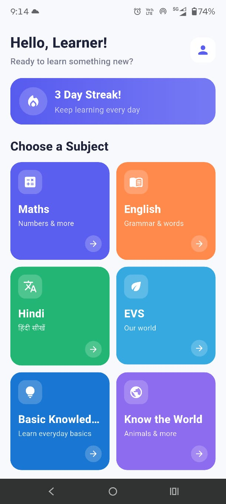
  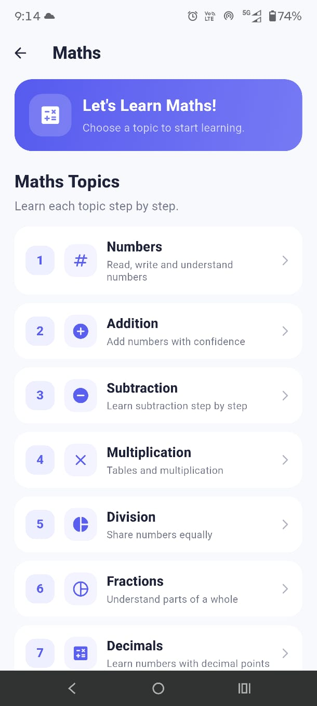
  
  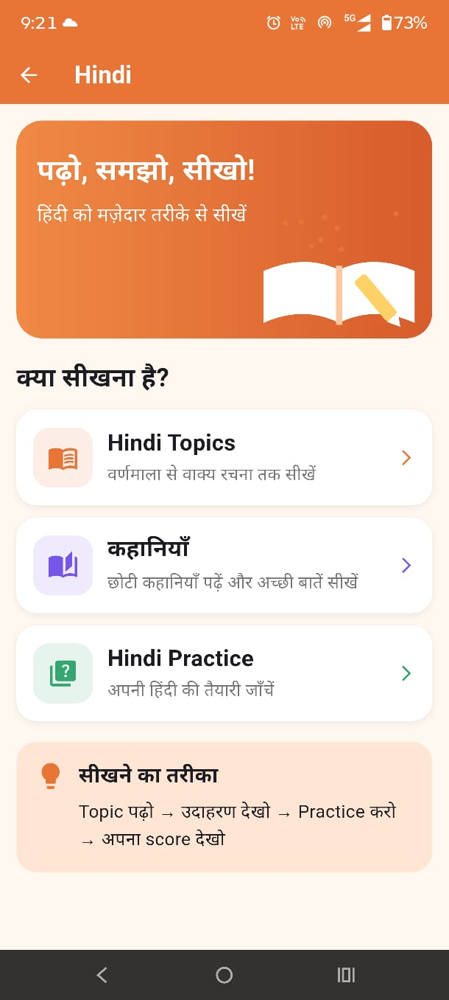
  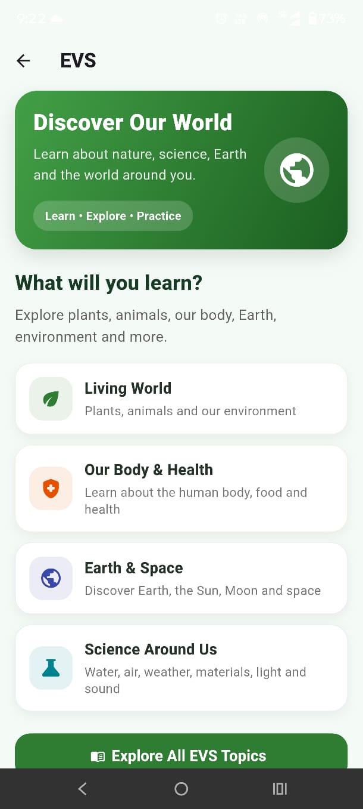
</p>

<p align="center">
  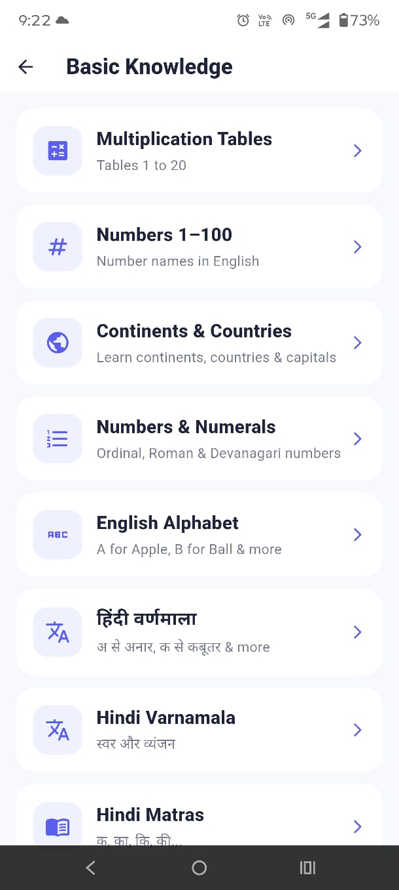
  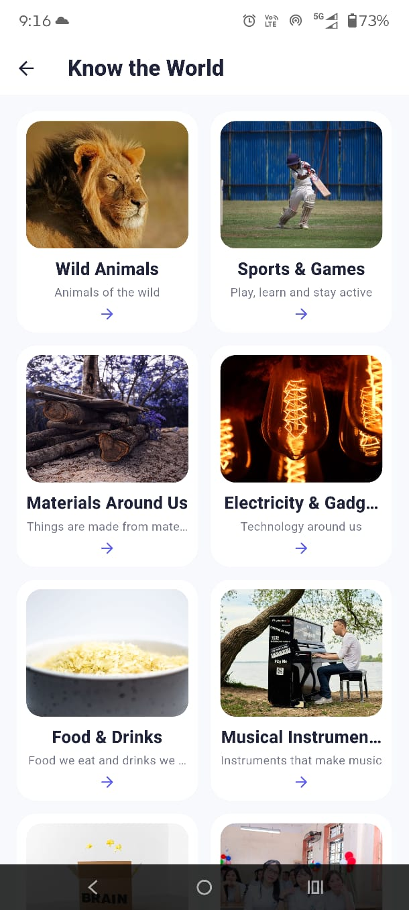
  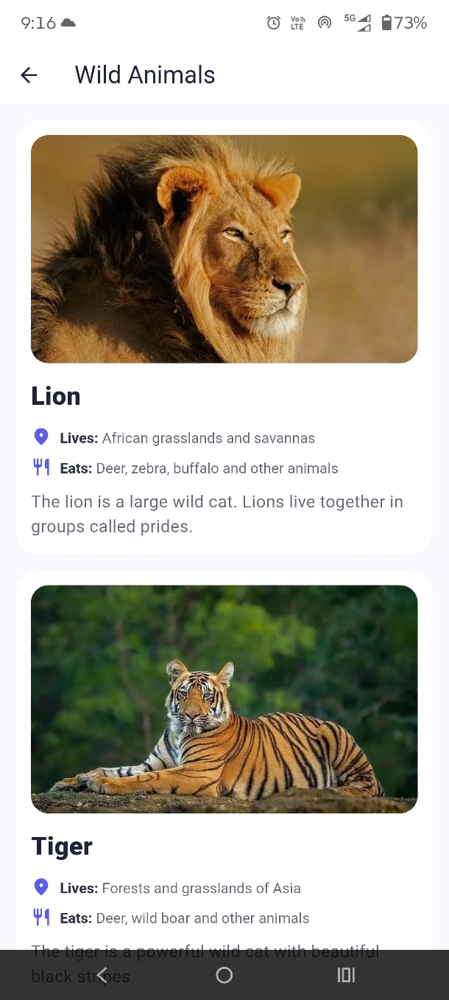
  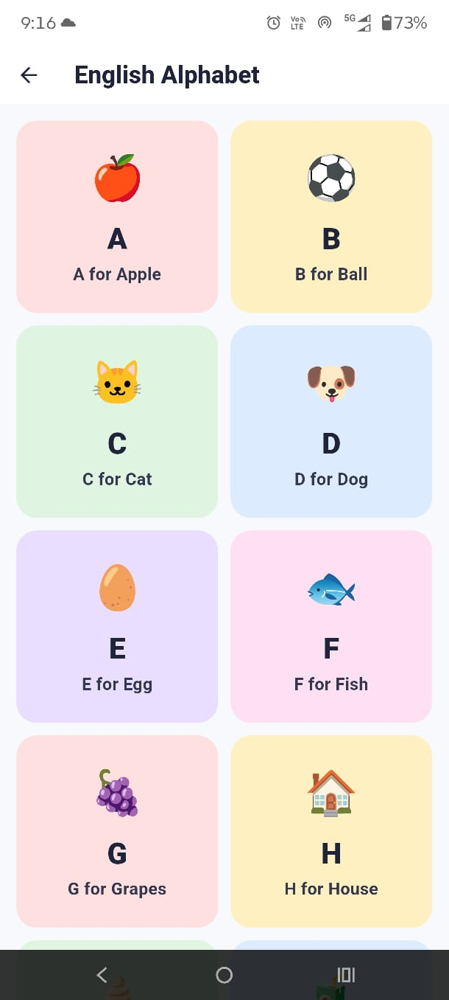
  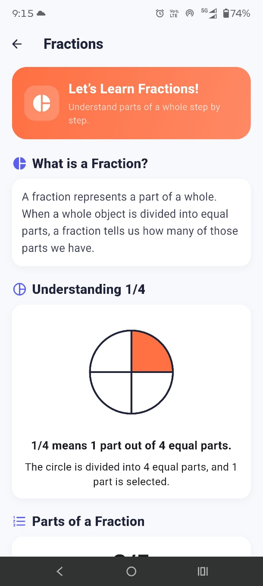
</p>

---

## ✨ Features

### 📐 Maths

- Numbers and basic mathematical concepts
- Multiplication tables
- Fractions
- Other Grade 4 mathematics topics

### 📖 English

- English learning topics
- Grammar and vocabulary
- English alphabet
- Simple learning activities

### 📝 Hindi

- हिंदी वर्णमाला
- हिंदी मात्राएँ
- Hindi learning topics

### 🌱 EVS

- Environmental Studies
- Our surroundings
- Basic concepts related to nature and the environment

### 💡 Basic Knowledge

Includes topics such as:

- Multiplication Tables
- Numbers 1–100
- Hindi Varnamala
- Hindi Matras
- Days & Months
- Measurement Units
- Seasons
- Time & Clock
- Shapes & Geometry
- Colours
- Directions
- Basic Road Signs
- Numbers & Numerals
- Continents & Countries
- National Symbols of India
- Indian States & Capitals
- English Alphabet
- Hindi Alphabet

### 🌍 Know the World

Includes visual learning categories such as:

- Wild Animals
- Pet & Farm Animals
- Birds
- Vehicles
- Fruits
- Vegetables
- Flowers
- Plants & Trees
- Places
- Professions
- Human Body
- Food & Drinks
- Sports & Games
- Musical Instruments
- Electricity & Gadgets
- Materials Around Us
- Insects

### 🧠 Quiz

The application also includes a quiz section for learning and practice.

---

## 🖼️ More Screenshots

<p align="center">
  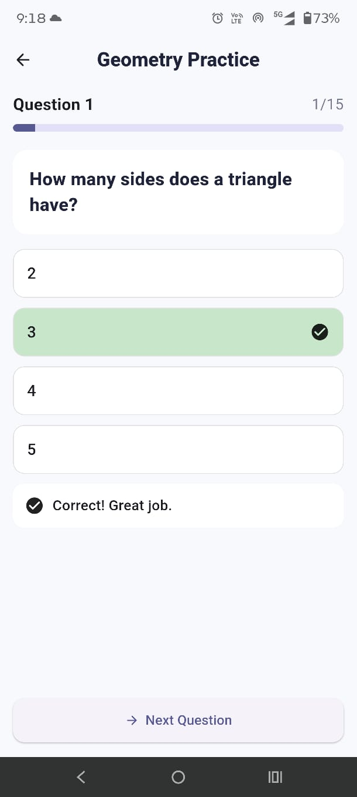
  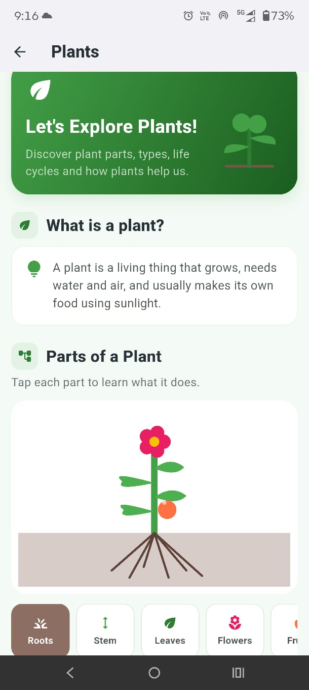
  
</p>

---

## 🛠️ Technologies Used

- **Flutter**
- **Dart**
- **Material Design**
- **Android**
- **Local Assets**

---

## 📂 Project Structure


grade4_learning/
│
├── lib/
│   ├── main.dart
│   ├── app/
│   ├── home/
│   ├── maths/
│   ├── english/
│   ├── hindi/
│   ├── evs/
│   ├── basic/
│   ├── general/
│   ├── progress/
│   └── quiz/
│
├── assets/
│   └── general/
│
├── images/
│   └── App screenshots
│
├── pubspec.yaml
├── README.md
└── .gitignore
``` text
